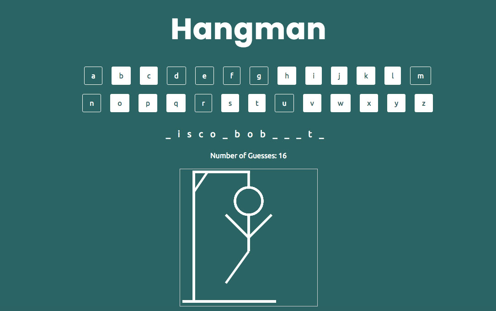

# Hangman JavaScript Game

## Approach

I decided to use the canvas element to create drawings that would render for each part of the hangman.

## User Stories

- As a user, I should know when I guess incorrectly by seeing a counter for number of guesses remaining.
- As a user, I should be able to know when I guess correctly by seeing letters appear for my guess.
- As a user, I should be able to press a button/link to select my letter choice.
- As a user, I should know when the game is over by receiving a 'game over' message.
- As a user, I should be able to play again.

[Play Hangman](https://megancoyle.github.io/hangman/)

## What's Next?

- Refactor code
- Make JS more modular/abstract
- Clean up functions and variables
